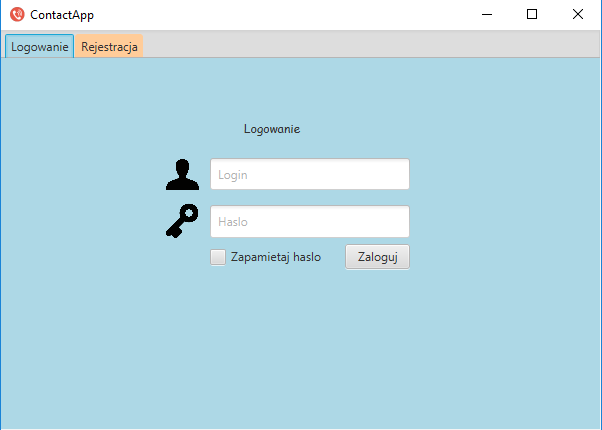
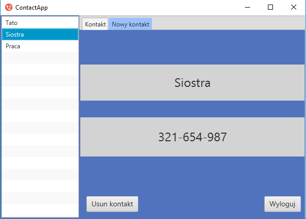

# ContactAppFX
ContactAppFX is a simple JavaFX application in which you can save your most important contacts.

## Table of contents
* [General info](#general-info)
* [Screenshots](#screenshots)
* [Technologies](#technologies)
* [Status](#status)
* [Contact](#contact)

## General info
I decided to created this application to expand my knowledge on JavaFX, MySQL and encrypt password (I used encrypt sha-256) which we save in database.

## Screenshots
Login section and adding a new user:

Main menu section and adding a new contact:

## Technologies
* Java 8
* JavaFX
* MySQL

## Status
Project is: _finished_

## Contact
Created by [@Paweł_Łukaszewski](https://www.linkedin.com/in/paweł-łukaszewski) - feel free to contact me!
